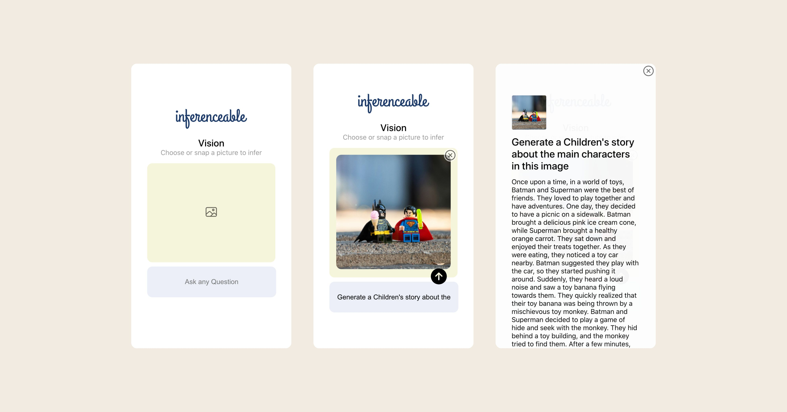

**Scalable AI Inference Server for CPU and GPU with Node.js**


> Inferenceable is a super simple, pluggable, and production-ready inference server written in Node.js. It utilizes llama.cpp and parts of llamafile C/C++ core under the hood.


## Supported platforms

- [X] Linux
- [X] macOS

## Installation

Here is a typical installation process:

### Get the code

```bash
git clone https://github.com/HyperMink/inferenceable.git
cd inferenceable
```

### Build

```bash
npm install
```

### Run

To run, simply execute `npm start` command, and all dependencies, including required models, will be downloaded.

> [!TIP]
> To use existing local models, set [INFER_MODEL_CONFIG](README.md#models) before starting

```bash
npm start
```

That's it! 🎉 Once all required models are downloaded, you should have your own Inferenceable running on [localhost:3000](http://localhost:3000)

\
&nbsp;

## Configuration

To start using Inferenceable, you do not need to configure anything; default configuration is provided. Please see [config.js](config.js) for detailed configuration possibilities.

### HTTP Server

```bash
export INFER_HTTP_PORT=3000
export INFER_HTTPS_PORT=443
export INFER_MAX_THREADS=4 # Max threads for llama.cpp binaries
export INFER_MAX_HTTP_WORKERS=4 # Max Node workers
```

### UI

A fully functional UI for chat and vision is provided. You can either customize it or use a different UI.

```bash
export INFER_UI_PATH=/path/to/custom/ui
```

* **Vision example**

  


* **Chat example**

  


### Models

By default, all required models defined in [data/models.json](data/models.json) will be downloaded on the first start. You can provide a custom models.json by setting the environment variable `INFER_MODEL_CONFIG`.

```bash
export INFER_MODEL_CONFIG=my/models.json
```

### Grammar

Default grammar files are available in [data/grammar/](data/grammar/). You can provide any custom grammar files either by adding them to data/grammar or by setting the environment variable `INFER_GRAMMAR_FILES`.

Grammar files needs to be in [GBNF format](https://github.com/ggerganov/llama.cpp/blob/master/grammars/README.md) which is an extension of [Bakus-Naur Form (BNF)](https://en.wikipedia.org/wiki/Backus%E2%80%93Naur_form).

```bash
export INFER_GRAMMAR_FILES=data/grammar
```

### Using your own llama.cpp binaries

Inferenceable comes bundled with a single custom llama.cpp binary that includes main, embedding, and llava implementations from the llama.cpp and llamafile projects. The bundled binary `data/bin/inferenceable_bin` is an [αcτµαlly pδrταblε εxεcµταblε](https://justine.lol/ape.html) that should work on Linux, macOS, and Windows.

You can use your own llama.cpp builds by setting `INFER_TEXT_BIN_PATH`, `INFER_VISION_BIN_PATH`, and `INFER_EMBEDDING_BIN_PATH`. See [config.js](config.js) for details.

\
&nbsp;

## Security

Inferenceable comes with pluggable Authentication, CSP, and Rate limiter. A basic implementation is provided that can be used for small-scale projects or as examples. **Production installations should use purpose-built strategies**.

### Authentication Strategies

Inferenceable uses passport.js as an authentication middleware, allowing you to plugin any authentication policy of your choice. A basic HTTP auth implementation is provided. For production, refer to [passport.js strategies](https://www.passportjs.org/).

> [!CAUTION]
> HTTP Basic Auth sends your password as plain text. If you decide to use HTTP Basic Auth in production, you must set up SSL.

```bash
export INFER_AUTH_STRATEGY=server/security/auth/basic.js
```

### Content Security Policy

Inferenceable uses [helmet.js](https://github.com/helmetjs/helmet) as a content security middleware. A default CSP is provided.
```bash
export INFER_CSP=server/security/csp/default.js
```

### Rate limiting

Inferenceable uses [rate-limiter-flexible](https://github.com/animir/node-rate-limiter-flexible) as a rate limiting middleware, which lets you configure numerous strategies. A simple in-memory rate limiter is provided. For production, a range of distributed rate limiter options are available: `Redis, Prisma, DynamoDB, process Memory, Cluster or PM2, Memcached, MongoDB, MySQL, and PostgreSQL`.

```bash
export INFER_RATE_LIMITER=server/security/rate/memory.js
```

### SSL

In production, SSL is usually provided on an infrastructure level. However, for small deployments, you can set up Inferenceable to support HTTPS.

```bash
export INFER_SSL_KEY=path/to/ssl.key
export INFER_SSL_CERT=path/to/ssl.cert
```

\
&nbsp;

## API

Inferenceable has 2 main API endpoints: `/api/infer` and `/api/embedding`. See [config.js](config.js) for details.

### Get API capabilities

```bash
curl -X GET http://localhost:3000/api -H 'Content-Type: application/json' -v
```

### Text based inference

```bash
curl -X POST \
  http://localhost:3000/api/infer \
  -N \
  -H 'Content-Type: application/json' \
  -d '{
    "prompt": "Whats the purpose of our Universe?",
    "temperature": 0.3,
    "n_predict": 500,
    "mirostat": 2
  }' \
  --header "Accept: text/plain"
```

### Image inference

```bash
curl -X POST \
  http://localhost:3000/api/infer \
  -N \
  -H 'Content-Type: application/json' \
  -d '{
    "prompt": "Whats in this image?",
    "temperature": 0.3,
    "n_predict": 500,
    "mirostat": 2,
    "image_data": "'"$(base64 ./test/test.jpeg)"'"
  }' \
  --header "Accept: text/plain"
```

### Text embedding

```bash
curl -X POST \
  http://localhost:3000/api/embedding \
  -N \
  -H 'Content-Type: application/json' \
  -d '{
    "prompt": "Your digital sanctuary, where privacy reigns supreme, is not a fortress of secrecy but a bastion of personal sovereignty."
  }' \
  --header "Accept: text/plain"
```

### Using a defined model name

```bash
curl -X POST \
  http://localhost:3000/api/infer \
  -N \
  -H 'Content-Type: application/json' \
  -d '{
    "model": "Phi-3-Mini-4k",
    "prompt": "Whats the purpose of our Universe?",
    "temperature": 0.3,
    "n_predict": 500,
    "mirostat": 2
  }' \
  --header "Accept: text/plain"
```
\
&nbsp;

## Thank you for supporting and using Inferenceable

Inferenceable is created by HyperMink. At [HyperMink](https://hypermink.com) we believe that all humans should be the masters of their own destiny, free from unnecessary restrictions. Our commitment to putting control back in your hands drives everything we do.

## Contributing

Pull requests are welcome. For major changes, please open an issue first to discuss what you would like to change.

## License

[Apache 2.0](LICENSE)
